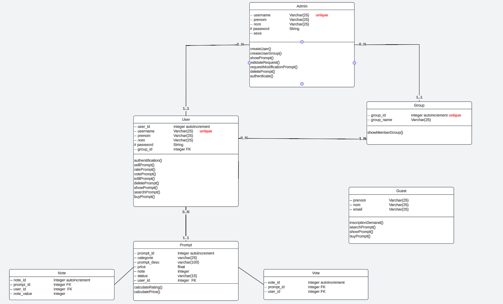

Welcome to my promptProject's README, here we're going to explain our code. 
Firstly we gonna create a db with postgreSQL.

Course : https://www.guru99.com/postgresql-drop-database.html

# Diagramme :
## Diagramme Use Cases

## Diagramme de Classe
   
# Data Base Creation
1. install PostegreSQL
   2. Open the terminal and run the following code
      * `sudo -u postgres psql;`
      * `create database pgtestdb;`
      * `create table table_name`
      
         exemple: 
      * 